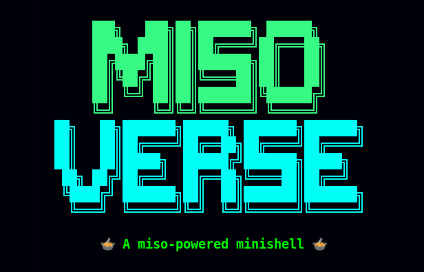

_This project has been created as part of the 42 curriculum by lde-san- and jemustaj._

---

<p align="center">
  
</p>

---

<h1 align="center">🦝🍲 MisoVerse 🍲🐛️</h1>
<p align="center"><b>the tastiest Minishell you'll ever see</b></p>

---

## 🎯 Description

**minishell** is a custom, minimalist implementation of a POSIX-compliant shell built
for the 42 School curriculum. The primary objective of this project is to bridge the 
gap between user input and the operating system kernel. By interpreting and executing 
raw command lines, the project demands a deep understanding of system architecture.

Developed entirely in C without any external parsing libraries, our MisoVerse features 
native support for essential built-in commands, multi-stage pipelines, I/O redirections, 
and environment variable expansion.

### 🧠 *Core Architecture & Concepts:**
- Lexical Analysis:
> Tokenizing raw strings, handling quotes, and validating command syntax.
- Process Management:
> Utilizing fork, execve, and waitpid to spawn and manage child processes.
- I/O Routing: 
> Managing file descriptors, pipelines (`|`), and data redirections (`<`, `>`, `<<`, `>>`).
- System Signals:
>Intercepting and routing asynchronous events like `Ctrl+C` and `Ctrl+\.`

---

## 🤖 AI Usage

AI was used as a **supporting tool**, mainly for:

 - 📘 General documentation lookup *(e.g. signals, system behavior, exploring bash's intricacies)*
 - 🔍 Code reviewing / catching subtle mistakes, critisizing and memory leak tracking.
 - 💣 Preventing unnecessary compile attempts *(a.k.a. “yes, you forgot a semicolon again”)*

## 🛠️ Instructions

### How to compile<br>

Make sure you have `cc` and GNU Make installed.<br>
<br>
In the project repository:<br>

• First compile the project
```
make
./minishell
```
• Or, if you want, you can compile to use valgrind command with flags:<br>

<br>

```
make leaks
./minishell
```

## 📚 Resources

Understanding shell behaviour and what project asks
* [Youtube video: Shell program explained](https://www.youtube.com/watch?v=ubt-UjcQUYg&t=1767s)
* [Medium article which walks through the project by [MannBell](https://m4nnb3ll.medium.com/)](https://m4nnb3ll.medium.com/minishell-building-a-mini-bash-a-42-project-b55a10598218)<br>

<br>More specific information related to shell/bash behaviour<br>
* [Medium article talking about lexical analysis by [Saman Mahmood](https://medium.com/@Saman-Mahmood)](https://medium.com/@Saman-Mahmood/lexical-analysis-304503896874)
* [Wikipedia article about file descriptors](https://en.wikipedia.org/wiki/File_descriptor)
* [GNU bash manual](https://www.gnu.org/savannah-checkouts/gnu/bash/manual/bash.html#Exit-Status)<br>

<br>General knowledge about c programming<br>
* [Geeks for Geeks website](https://www.geeksforgeeks.org/c/c-programming-language/)
* [GNU manual for creating a makefile](https://www.gnu.org/software/make/manual/make.html#Simple-Makefile)
